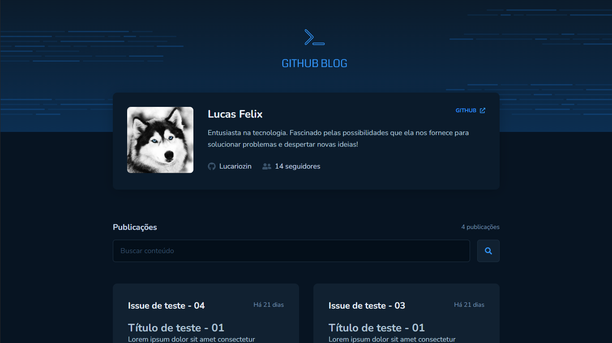
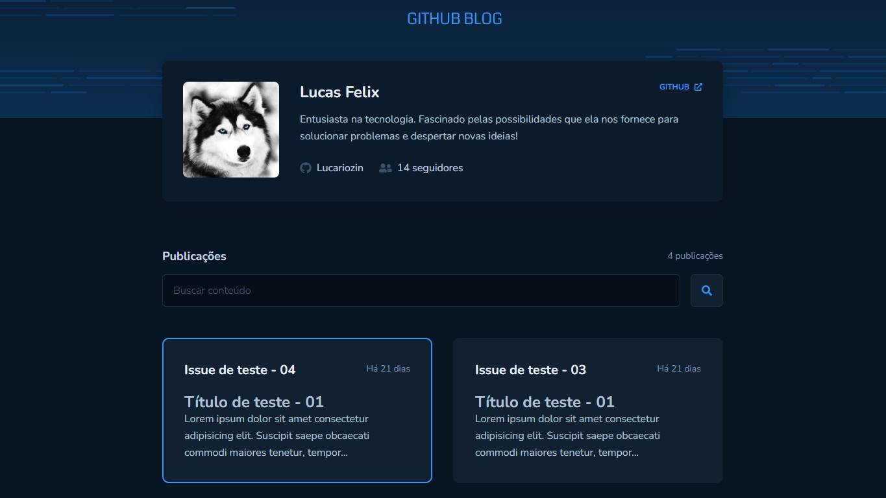
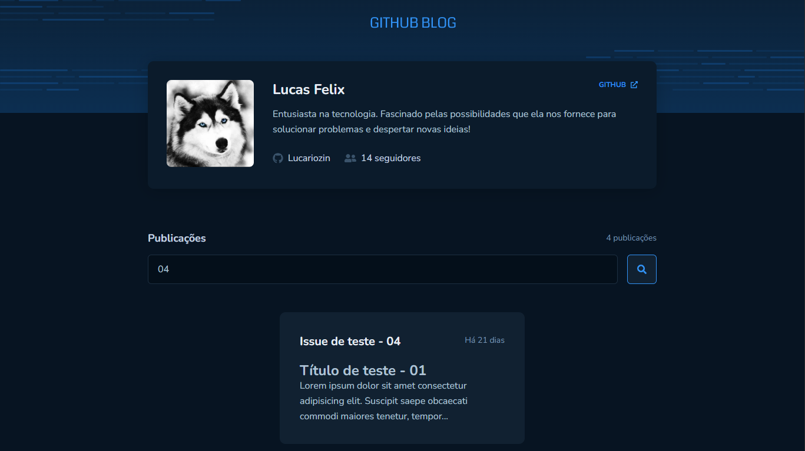
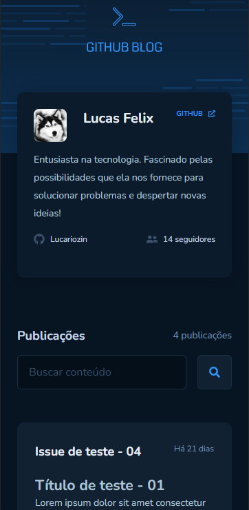
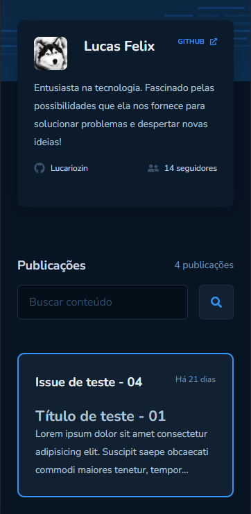
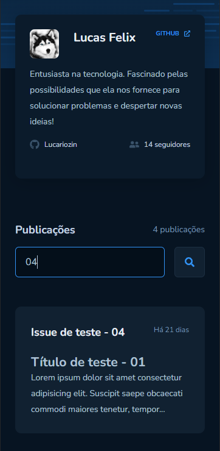
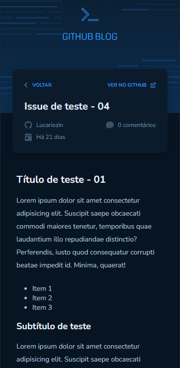

<h1 align="center">👑 Rocketseat | Github Blog 👑</h1>

Aplicação Front-end desenvolvida como um desafio proposto na trilha de ReactJS do Ignite da Rocketseat com o objetivo de exibir issues de um determinado repositório utilizando as APIs públicas do Github.

  
  

##

## ✔️ Tecnologias utilizadas

- ``Vite``
- ``ReactJS``
- ``TypeScript``

## Desktop:

### Home

### Publications

## Mobile:

### Home

  ⠀⠀⠀⠀⠀⠀⠀⠀⠀
  

### Home | Publications

  ⠀⠀⠀⠀⠀⠀⠀⠀⠀
  

