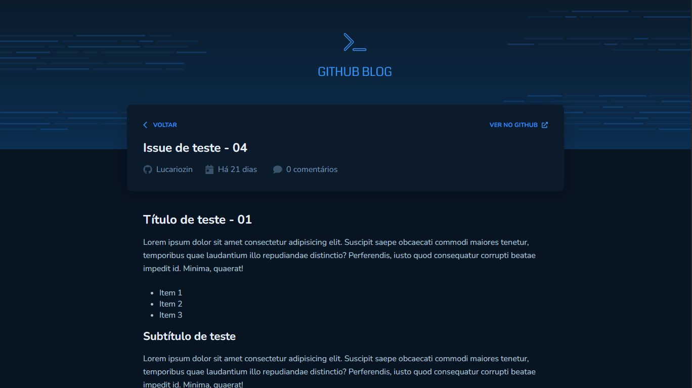

<h1 align="center">👑 Rocketseat | Github Blog 👑</h1>

Projeto desenvolvido na trilha de ReactJS do Ignite da Rocketseat.

## Desktop:

### Home

### Publications

## Mobile:

### Home

  ⠀⠀⠀⠀⠀⠀⠀⠀⠀
  

### Home | Publications

  ⠀⠀⠀⠀⠀⠀⠀⠀⠀
  

